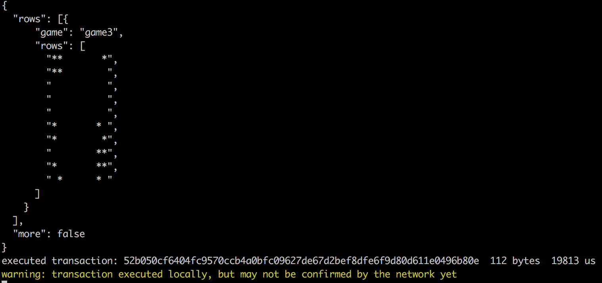

# GAME OF LIFE for EOS in TypeScript

 Step by step guide on how to execute our first TypeScript proof of concept, where we modified the version of Game of Life that Conway proposed by Fleming on https://github.com/tbfleming/eos-game-of-life. 
 
 You will be able to see the implementations in TypeScript of:


- Use of apply and execution of actions
- Deserialization of contract entry parameters
- Use of require_auth
- Read and Inserts in tables
- Using same abi file between c ++ and TypeScript


## 1 Prerequisites - Access to EOS Testnet / Node

- option 1) Configure your Node using EOS Tutorial **https://github.com/EOSIO/eos/wiki/Local-Environment**

- option 2) Join **http://eosaurora.io** Testnet, ask for an account & support.


- note:  in case you build your own node remember to change token from SYS to EOS on CMakeLists.txt

## 2 Clone and install AssemblyScript

```bash
git clone https://github.com/EOSArgentina/assemblyscript.git
cd assemblyscript
npm install
npm link
```
- For this test, you would need to create a custom version of AssemblyScript, we have already modified it for you on our Github, the only difference is the a mod to prevent import abort function which is not available in EOS.

## 3 Clone GameofLife-ts

```bash
git clone https://github.com/EOSArgentina/gameoflife-ts
cd gameoflife-ts
```

## 4 Prepare EOSIO Chain Context 

```bash
./scripts/01-prepare.sh
```
- review this script provided as example and update with your actual context, eg your wallet pass, change cleos to a remote http like cleos  -u http\:// remote, change your keys, etc.
- this script should be only executed once, during setup, is setting eosio.token and eosio.system contracts, creating eos token, and creating gameoflife account.


## 5 Compile

```bash
./scripts/02-compile.sh
```
- underthehood this compiles using asc (assembly script), then execute sed to hack wast to allow eosio to understand this wast file.

## 6 Deploy Contract
```bash
./scripts/03-deploy.sh
```
- uploading contract to the testnet

## 7 Call TypeScript Action
```bash
./scripts/04-play.sh
```
- if all worked well you are going to see animated game of life results.
- review each script, if you have any question don't hesitate to ask us for support on http://eosaurora.io -> telegram.





